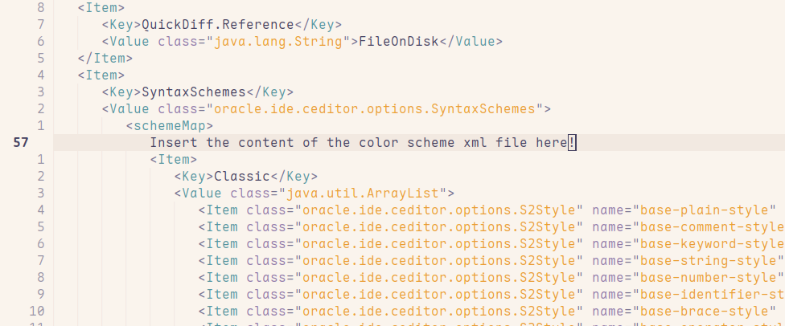
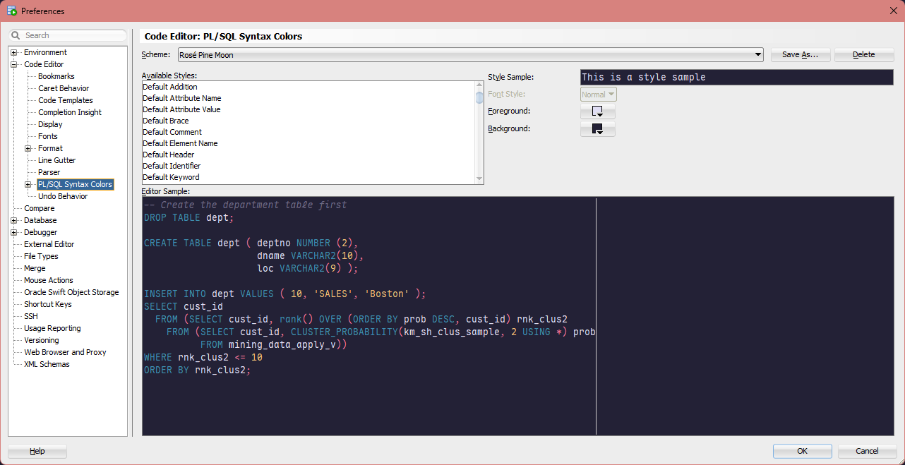
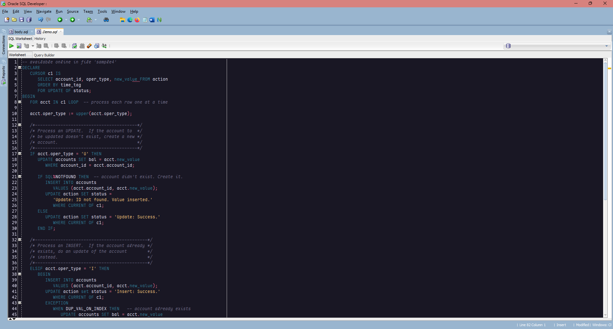
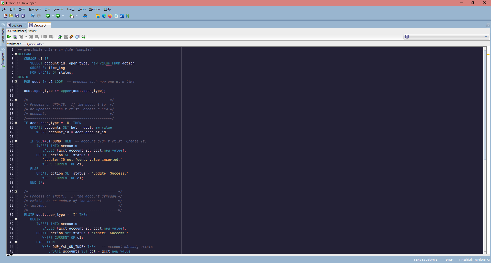
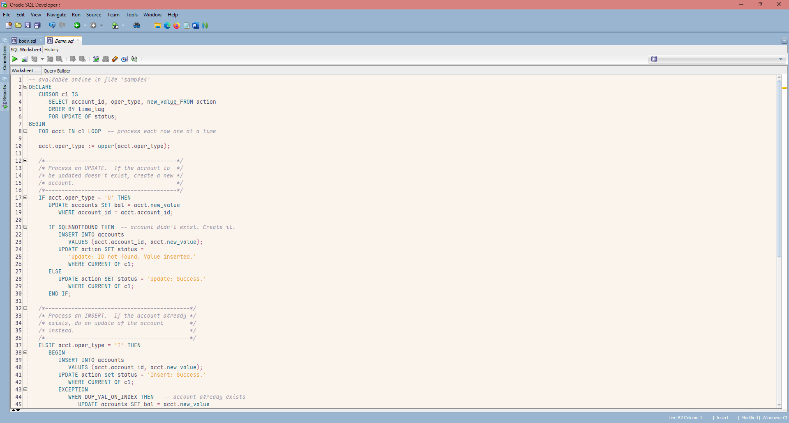

    
    <h2 align="center">Rosé Pine for SQL Developer</h2>

All natural pine, faux fur and a bit of soho vibes for the classy minimalist

## Installation

Unfortunately Oracle doesn't make it easy to import a new colour scheme into SQL Developer, thus a little bit of hacking is required.

1. Close SQL Developer. This is important. If you modify the scheme file while SQL Developer is open, your changes won't be saved.
2. Locate the file dtcache.xml in the [SQL Developer's settings directory](https://docs.oracle.com/en/database/oracle/sql-developer/19.1/rptig/installing-sql-developer.html#GUID-16F0A7C3-6EC1-4176-9B15-FE4AA8D70D5F).

    **Windows:**

    `%APPDATA%\SQL Developer\systemn.n.n.n.n.n\o.ide.n.n.n.n.n.n.n`

    Example:

    `C:\Users\YourUserName\AppData\Roaming\SQL Developer\system26.2.0.186.2220\o.ide.14.1.2.0.42.260217.1610`

    **Linux or Mac OS X:**

    `~/.sqldeveloper/systemn.n.n.n.n.n/o.ide.n.n.n.n.n.n.n`

    Example:

    `~/.sqldeveloper/system19.1.0.094.2042/o.ide.13.0.0.1.42.170225.201`

3. Locate &lt;schemeMap> tag inside dtcache.xml file.

4. Insert the content of the color scheme file Rosé Pine.xml inside &lt;schemeMap> alongside the other colour schemes. Be careful not to break the XML. But don't worry about the identation, SQL Developer will format the XML the next time you launch it.

5. Launch SQL Developer. Navigate to menu Tools->Preferences, then select item Code Editor -> PL/SQL Syntax Colors in the left pane.

6. Select theme in the "Scheme" drop down list on the top.

 
 You can see the original instructions provided by the [Dracula Theme Team](https://draculatheme.com/oracle-sql-developer) and by [Ozmoroz](https://github.com/ozmoroz/ozbsidian-sqldeveloper/blob/master/README.md):

## Gallery

### Rosé Pine

### Rosé Pine Moon

### Rosé Pine Dawn

## Thanks to

- [Serge2702](https://github.com/Serge2702)

## Acknowledgements:
- [ozmoroz](https://github.com/ozmoroz/ozbsidian-sqldeveloper/blob/master/README.md) and [Dracula Theme](https://draculatheme.com/oracle-sql-developer) for the original instructions for how to install a theme for Oracle SQL Developer.

## Contributing
You can edit the colorscheme in the Preferences window of SQL Developer, and extract the changes from the dtcache.xml file.
